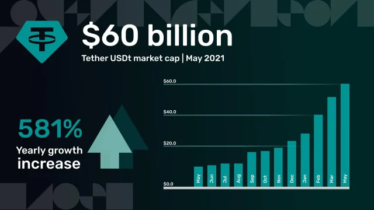
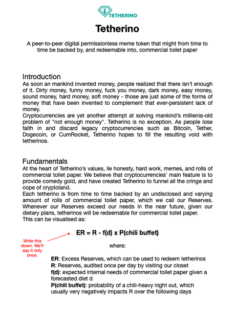
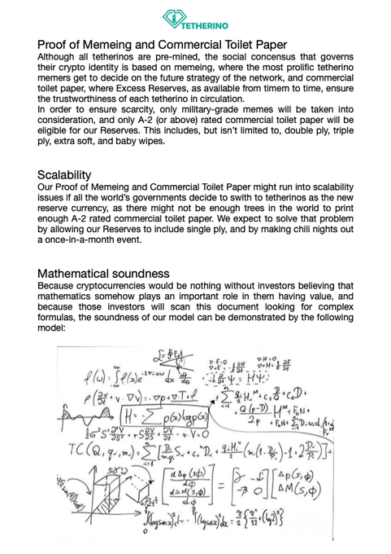
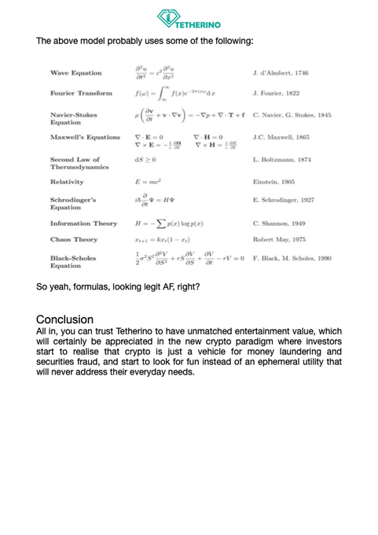

# Awesome Tetherino - 60 000+ Million $USDT Crypto "Stable" Coin Printed Out of Thin Air and Offically Backed by Commercial Paper (2-Ply Rated Soft - Yes, Trust Us, Don't Verify) - Inside the Tether Ponzi Scheme - A Bubble for the History Books and Fraud on the Scale of Madoff

> Tether has surpassed a $60 Billion market cap! In May 2020, Tether tokens' market cap was $8 Billion,
> now a year on we've seen an increase of 581% and demand for Tether token use higher than ever for both trading and retail adoption!

> "Sometimes we wonder whether we are dreaming because the growth has been incredible". What's next? 
> Get to know more about Tether's transparency, ecosystem initiatives, and future plans through the words of Paolo Ardoino and Stuart Hoegner.
>
> If you look at the history of Tethers growth you'll see that it took a bit of time
> for cryptocurrency exchanges to understand why it was important to have Tether $USDT replace $USD in the crypto markets.
> Tether $USDT is a reliable and quick liquid utility
> [- a money printer & lender of last resort. Cryptocurrency exchanges can cash-out bagHODLers anytime in...  $USDT!
> Tether's market cap is growing fast, with a monthly increase of $10 Billion. Will we reach $100 Billion before 2022? 🚀🚀🚀]
> 
> "Tethers are 100 percent backed, full-stop," said Stuart.
>
> -- Official Tether Week Podcast with Paolo & Stuart  

§§§

> We have not entered "Post Tether" yet. Tether is still furiously printing
> digital ($USDT) bucks. Who believes Bitcoin's price is organic?
> It's not - it's a Ponzi, and Tether is its Little Helper.
>
> Austrian Maximalist comments:
>
>> Bitcoin is not a ponzi. It is a monetary network, first of its kind.
>> Currently valued at thousand billion dollars. What am I missing?
>
> §
>
> If you can print billions and billions in fake money, you can make the
> price of Bitcoin whatever you want - until too many people try and cash
> out, that is.
>
> -- Amy Castor, Blockchain & Financial Journalist

§

> Tether is "too big to fail" - the entire crypto industry utterly depends on
> it. We just topped ~twenty~ sixty billion alleged dollars' worth of tethers ($USDT).
> If you think this is sustainable, you're a fool.
>
>  -- David Gerard, Blockchain Journalist & Historian

§

> Congrats on writing about Bitcoin's price without mentioning Tether ($USDT).
> It's like writing about bond yields without mentioning inflation and the Fed.
>
> §
>
> Now you have Tether and $USDT. 60+ billion almost dollars governed by a
> five-page disclaimer that $USDTs are backed by whatever Tether wants, at
> whatever valuations Tether finds convenient. No credit rating, no bank,
> no auditor, no offices, no CEO and CFO, no guarantee whatsoever.
>
> §
>
> The USDT/USD peg is founded on the premise that people won't try
> to cash out en masse. As long as they don't, USDT printing can continue.
>
> §
>
> Why should Tether spend all its money (it is theirs, after all -
> $USDT holders don't have a legal claim on Tether's reserves)
> trying to save the crypto markets, when they collapse?
> How many years would it take them to rebuild their war chest,
> assuming that crypto bounces back?
> Why not party on a yacht in Monaco instead?
>
>  -- Trolly McTrollface, Bitcoin Greater Fool Court Jester

## Tetherino HQ

Website: [**tetherino.io**](https://tetherino.io/), Twitter: [**tetherino**](https://twitter.com/tetherino)

Tetherino once stayed behind in the shadows, watching my big Tether step-brother print and print but no more! I'm ready to take over the family business and print even more than my famous brother! Pump the markets!

**Whitepaper**

## Q&A with Paolino Ardoino, the CTO of Tetherino

**Q: Please tell me about Tetherino's technology.**

**Paolino Ardoino:**
Well from a purely technological perspective, Tetherino is absolute shit. I launched it in under five minutes by clicking on the first result when you google "launch your crypto token in under five minutes".

The only purpose of technology in crypto is to add just enough layers of complexity to every scam so scammers can get off the hook. This is what we're shooting for.

**Q: Very interesting. What else can you tell me about your token?**

**Paolino Ardoino:**
It's very important for people to understand that there's nothing
behind our token. No backing, no reserves, no commercial toilet paper, no assurances, no white paper. Fundamentally, the value of a tetherino is zero.

**Q: Amazing. I hear you already have a logo and even a website. What are your next steps?**

**Paolino Ardoino:**
Yes we're very proud of our progress so far. Our next steps are to communicate about our token on social media from anonymous accounts and hope people start buying our illiquid token with other, slightly more liquid tokens, which we'll try and cash out for real money.

**Q: So you're just following the basic roadmap of all coins and tokens in crypto?**

**Paolino Ardoino:**
On the surface, yes. Nothing special about us, no use case, no vision, we don't understand anything about finance have zero willingness to learn.

**Q: There is literally no barrier to entry in creating a new token. What makes you think you'll be successful, given the fierce competition from millions of other crypto scammers out there?**

**Paolino Ardoino:**
Crypto has gone through a paradigm shift over the last few months. Everybody understands that the technology is shit, and that it's all about money laundering and memes.

Most of the existing projects bear the burden of their image. Their teams spent so long bullshitting about their technology and network effect that they can no longer pivot to memes without looking stupid. So as crypto has moved from pretend fintech to the entertainment business, all the other coins and tokens have lost their relevance.

Tetherino doesn't have this burden of legacy. We are giving the investors what they want - pure memes, military grade entertainment and shitposting. Our bagholders recognize and appreciate that.

**Q: But what about projects like Ripple and Chainlink? Surely their investor base has been built around memes and not technology as well?**

**Paolino Ardoino:**
They have been the pioneers in this area, yes, but they had to build their meme framework from scratch, which took a lot of time and effort, and now they're stuck with an outdated meme infrastructure that's a nightmare to maintain.

Tetherino on the other hand, can take advantage of existing frameworks of comedy gold around tokens like $USDT and $USDC. We can build on top of this existing meme infrastructure, and roll out our next generation memeing which will make Tetherino a success.

**Q: Aren't you afraid that by being so straightforward and open about your plans, people won't buy your tokens?**

**Paolino Ardoino:**
On the contrary. People are fed up with all the lies and scams in crypto. They want revenge, they want closure. We give them that. By buying tetherinos, you're not simply betting that you'll be able to offload your bags on the next sucker at a higher price. You're buying entertainment, you're rewarding all the people who are working very hard to make fun of the scammers and the crooks. Join the revolution, brother! Long tetherinos, short the crooks!

 §§§

Less than 12 hours after our first Q&A was published, Paolino's Twitter account was suspended by Twitter without any warning or explanation. It's obvious that Tetherino, the young and ambitious project that aims at revolutionising crypto by deploying its proprietary next-gen memeing framework, is seen as a threat by the crypto establishment. Here's an emergency update of the situation, as it happens.

**Q: Less that an hour ago, I learned that your account was being censored. It looks like vested interests are trying to kill Tetherino in the egg.**

**Paolino Ardoino:**
Absolutely. Thank you so much for doing this second interview under such short notice. Time is of the essence here. Crypto insiders must have learned of our secret partnership project with a toilet paper manufacturer. We are about to achieve a groundbreaking revolution in the industry.

**Q: Unbelievable. How do you think they've learned about this partnership?**

**Paolino Ardoino:**
I tweeted about it a couple of hours ago.

**Q: They must have spies everywhere. What's the project about?**

**Paolino Ardoino:**
We will unveil a feature on our website that will allow people to use tetherinos to buy double ply, extra soft, A-2 rated commercial toilet paper on our website. This will put us ahead of virtually 100% of the competition, by giving an actual, real world use case to tetherinos. No wonder the crypto establishment feels threatened.

**Q: I'm at loss for words. How did you manage to come up with such a new paradigm?**

**Paolino Ardoino:** Well we were thinking that you can't really do anything with tokens other than buying other tokens. Then we remembered the Bitcoin pizza, how it became a killer meme for Bitcoiners, and decided to do the same for tetherinos. It made absolute sense, especially as you need toilet paper after pizza.

**Q: Aren’t you fearing for your life right now?**

**Paolino Ardoino:**
Absolutely. To think that people who supposedly manage tens of billions of dollars, in reality spend their days spying on Twitter parody accounts with 50 followers truly sends chills down my spine. If they took their time to file a complaint, putting aside all the super important stuff that they undoubtedly need to take care of, what else can they do?

**Q: Will you quit?**

**Paolino Ardoino:** I thought about it. But then, I realised this cowardly attack is simply proof that the competition is afraid. They are losing the innovation race. Unable to keep up with our next-gen memeing technology, they are resorting to dirty tricks. In doing so, they have already put on their LOSER hats.

**Q: You are incredibly brave, Paolino. Do you want to add something?**

**Paolino Ardoino:**
Yes. I want our investors to know that I love them, that I feel all their support, and that they'll soon be able to buy double ply, extra soft, A-2 rated commercial toilet paper rolls for 1,000,000,000 tetherinos apiece, with international delivery, conditions might apply. The price will be revised downwards as tetherinos moon, because, as everyone knows, our tokens are deflationary.

**You're truly doing God’s work, Paolino. God speed!**

<!--
  sources:
  http://www.tr0lly.com/tetherino/an-interview-with-paolino-ardoino-the-cto-of-tetherino/
  http://www.tr0lly.com/tetherino/emergency-interview-with-paolino-ardoino-cto-of-tetherino/
  -->

## Tetherino is Setting a New Standard for Transparency - And Responding to Criticism That is Backed by Real Cash

by Stuartino Hoegnerino, the General Counsel of Tetherino

Crypto insiders claim to have new technologies, ideas, or visions that will change the world. 
They hope people pretend to believe them in the hope that someone else will buy their shitcoins 
for more than they have paid for them. So they entertain a Potemkin façade of debate and what they call 
"healthy scepticism", as long as it doesn't threaten their fragile ego and don't trigger 
their small dick syndrome.

As a member of this community, Tetherino issues a token. 
Like all other tokens and coins in the crypto ecosystem, tetherinos peg their value 
to the hopes and dreams of their bagholders, who pray 24/7 that the founders 
who own 90% of the supply with a basis cost of zero won't rug pull them 
before they're able to dump their tokens or coins on even greater fools than themselves.

**Our lack of attestation proves that we're not backed**

Despite our best efforts, some FUDsters have tried to spread rumours that me might be backed 
by real commercial paper of bonds that are investment grade and not completely worthless 
accounting entries created out of thin air when we issue tetherinos to our good friends and accomplices. 
I cannot stress it enough, this is a lie. We don't follow any established accounting practices 
but the ones me make up on the go. The commercial paper and bonds in our portfolio are completely made up. 
We have a little bit of cash, sure, but that's just because we got lucky at the roulette table 
last night and forgot to wire it to our personal account in Canada.

**Our settlement with the New York Attorney General's (NYAG) office should be seen as a measure of our desire to put the matter behind us**

If you think the title above makes absolutely no sense, 
congratulations, you can read. FYI, we have provided exactly one page of documents to the AG, 
to which she answered, "wow, that's exactly what I needed, thanks!", and we were done. 
It took us 15 minutes to settle the matter. We agreed we would publish a pie chart 
where we show that we own zero assets and that our tokens are not backed, 
and that's it. We swore we'll never do business in NY, and we won't, 
because we have no clue how to do business in NY.

**Our reserves breakdown offers complete transparency into Tetherino's reserves**

We're not backed. This is shown by our reserves breakdown that's just a blank page with nothing on it. 
You can buy our coins on the sole assumption that you're early and you're getting in on the ground floor 
of a potentially successful decentralised pyramid scheme where our memeing and relentless 
shitposting will manage to create a base of suckers who will buy the early adopters' bags for 1000x the price.

**Words and actions and bullshit**

This part is about inspiring you to buy more tetherinos with real hard cash.
We'd like you to imagine that by doing so, you're challenging the status quo and making bankers 
and other people who you envy fear for their lives. 
The more tetherinos you buy, the more you'll stick it to everyone who are successful and happy and fulfilled. 
If you buy enough tetherinos, that hot chick from flat 103 in your building will break up 
with her surfer boyfriend because his dick will fall off. 
Then if you keep buy more tetherinos she will secretly fantasise about you in secret, 
without ever revealing it. BUY TETHERINOS.

<!-- source:
https://stuartinohoegnerino.medium.com/tetherino-is-setting-a-new-standard-for-transparency-and-responding-to-criticism-that-is-backed-9971812cfc23
-->

## What If?  A day in the life of Stuart(ino) Hoegner(ino), General Counsel for Tether(ino)

>  It's amazing the time and resources Tether spends on hunting down and harassing critics.
>  [...]
>  I will take the piece down, even though it's obviously satire.
>  [...]
>  I'm really proud of my piece "A day in the life of Stuart Hoegner, General Counsel for Tether",
> whose title is a reference to the book "One Day in the Life of Ivan Denisovich", by Aleksandr Solzhenitsyn,
> a vocal critic of the USSR who did 8 years in a Siberian Gulag for having the audacity of writing stuff.
> [...]
> I think we live in meme world where the most efficient way
> to fight evil is to make fun of it in a way that makes
> it lose its credibility.
>
> -- Trolly McTrollface, Bitcoin Greater Fool Court Jester

<!--
 https://twitter.com/Tr0llyTr0llFace/status/1396729914615910406
-->

Note: This is the satirical post that Trolly McTrollface wrote on his blog.
Feel free to put a copy up.
Here are others: [[David Gerard](https://davidgerard.co.uk/blockchain/2021/05/24/rehost-tr0lly-a-day-in-the-life-of-stuart-hoegner-general-counsel-for-tether/); [Amy Castor](https://amycastor.com/2021/05/24/rehost-a-day-in-the-life-of-stuart-hoegner-general-counsel-for-tether/); [write.as](https://write.as/mq17sa8ebz9bx.md)]

May 18, 2021

In light of an anonymous Medium post titled "Tether is Setting a New Standard for Transparency - And Responding to Criticism That is Untethered From Facts", written by someone posturing as Stuart Hoegner, the General Counsel for Tether, in a something that looks like pointless attempt to make Tether look like a legitimate business, the truth needed to be told. So here it is, in all its unvarnished glory. A tale of how it all happened.

The morning sun was gently piercing through the mist glowing around the harbour. Suart Hoegner was standing by the window, his empty stare aimlessly fixated on the horizon.

The coffee cup was sitting on the window sill, untouched, its contents getting cold. Stu was feeling much like that cup, isolated, forgotten, the fire inside of him running out.

What had happened to his dreams? Where was his ambition gone? How did he ever end up in this dead end of a situation, catering to small time Italian crooks, lending them his name, his expertise, his reputation, his life?

The people at Deltec would be at the office an hour from now. The Bahamas was in the exact same time zone as Prince Edward County, but what looked like a huge convenience in 2017, when Stu had started working out the relationship, felt like the shackles of a prison four years later. At least Paolo Ardoino was commuting between Monaco and London, leaving five hours of alone time to Stu in the evening when he could try and recollect. Giancarlo Devasini, the international man of mystery and Stu's boss, was popping up here and there sporadically around the world, mostly leaving Stuart alone. But Deltec! These guys were non-stop. Amateurish, overzealous, excited and afraid at the same time, they’d call him a dozen times over the span of a single hour for utterly mundane shit like a weekend wire. "We can't do this, we can't do it like that, the ISIN code you provided for the bond you say you have on your books doesn't exist, this commercial paper isn't rated..."

Stuart closed his eyes, and let out a deep sigh.

He kind of knew what he was signing up for, when he shook hands with Giancarlo and Paolo, that fateful evening at a gaming conference in Toronto.

When you're a regulated financial institution, you're dealing with the cream of the crop, you have to prove that you're trustworthy and beyond reproach to the most sophisticated players. You're in the limelight, you brush elbows with legends, you dine with intellectuals and people who will leave a mark in this world.

But Stu knew he was never going to be up to that level. Stuck in a tiny practice catering to the gaming industry, he was doomed to a life of absolute insignificance and quiet desperation. So he jumped ship, to the gutter.

When you're an unregulated bucket shop scalping muppets, posturing as a revolutionary blockchain fintech something, you never see the limelight. Your job isn't to compete with the top 0.01%, it’s to baffle and bamboozle the bottom 50%. Instead of having fifty accounts worth $100,000,000 each, you'll have to deal with a hundred million accounts worth $50 each. You'll become a joke among your former colleagues, nobody will write to you for a recommendation, your own mom will stop asking how the job's going.

A tear rolled down Stuart's cheek.

He was stuck playing Laurel and Hardy with Paolo, to keep the appearance of legitimacy and technological innovation for Tether, in the eyes of a million suckers who were bagholding their shittoken, USDT. Stu's job was to make sure Tether's employees and accomplices would never say or write something that might incriminate his employer, always keeping a veneer of plausible deniability in the eyes of the law, all the while appearing strong and legitimate in the eyes of the illiterate cannon fodder.

Twitter was a perfect tool. At the head of an army of anonymous bots, Stu could post bullshit memes and retweet crazy-ass conspiracy theories that made Tether look good. Unable to provide a real audit or any report that would make sense in the real world, he would come up with one worthless attestation after another, drafting legally non-binding opinion letters to be signed by obscure accounting shops.

Cope. Cope. Cope.

And then one day, his boss came up with this "Tether leaks" idea, to discredit Tether critics, who could see through the nail-polish-thin Potemkin façade that Stu had set up, and deemed it worth their time to warn others. Giancarlo instructed Stuart and Paolo to write a series of supposedly leaked emails from Deltec that would be revealing of Tether's fraud, and post them on Twitter, for critics to bite on. They could then reveal that the emails were fake, and that anyone who believed in them was an idiot unworthy of being attention to.

This was the straw that broke the camel's back. Stu was stuck forging documents, setting up fake Twitter accounts, and fishing for journalists to take the bait. This was one step too far off his idea of what a legal counsel was supposed to be doing. And to be exposed by an anonymous account going by the name of Trolly McTrollface!

Something broke inside him that night. The light went out.

Suddenly, a sunbeam broke through the mist, and hit Stuart's face. Even with his eyes closed, he could feel the warmth on his face, and let himself bask in this uplifting feeling. A wave of rage and inspiration suddenly crashed up on him. His hands started shaking, as a supernatural force was taking control of his thoughts and movements.

Stuart rushed to his laptop, and started typing. He typed like never before, like he never could. For a moment in time, Stu was transported in a parallel universe, one where he was an actual big boy lawyer, working for a legitimate business, where he could say and write words that had real meanings. A world where his own existence had a meaning

Established and recognized procedures.

In accordance with the International Auditing and Assurance Standards Board (IAASB).

The vast majority of the commercial paper we hold is in A-2 and above rated issuers.

The commercial paper we hold is purchased through recognized issuance programmes.

The lion's share of our bond portfolio is investment grade as rated by S&P, Moody's, or Fitch.

Stuart typed, and typed, and typed. For the first time in years, he felt alive. He was proud of himself, albeit in an imaginary way.

When he was done, the sun was high in the sky, and his phone showed fifty seven missed calls. It was like a hole in the continuum of time had engulfed him, chewed him, and spat him out. He was shaking, drenched in sweat, heart racing, his vision blurry.

He tried to read what he had written.

It was beautiful. A vision of a world that wasn't bullshit, scams, and shame. A world that would never exist anywhere else, but on those two pages of his own creation.

Stu needed to put it out, put in somewhere others could read it. He couldn't post it on his own Twitter account. He couldn’t even admit or deny that it was real or fake. Plausible deniability, all that stuff.

He created a new account on Medium, and copy-pasted it there, in all its glory. Then he dropped a link to Paolo.

Smoke and mirrors, bitch.

 §§§

Do you prefer non-fiction?
For background reading try
"$USDT's Endgame and Life After Tether"
by Trolly McTrollface, February 15, 2021

> Tether's days are counted - whether by natural implosion,
> or as a result of regulatory action,
> the stablecoin funding a wide array of offshore crypto activity will
> go the way of the dodo.
>
> [...]
>
> $USDT lifecycle
>
> Tether's stablecoin $USDT is mainly used as a tool for offshore funding.
> The proceeds of each $USDT print are sent mostly to offshore exchanges.
>
> $USDTs are mostly used as collateral for margin trading,
> and for stacking (or "yield farming").
> Yield farming is far less reliant on $USDT, but it's still advertised
> as one of the ways to get eye-watering returns without price risk.
> With advertised "expected returns" ranging anywhere from 10% to 50%,
> it happens almost exclusively on unregulated platforms,
> and the source of returns is... unclear to say the very least.
> In the real world, anything beyond a 5% ARR reeks of horrible
> counterparty risk and probable default. In the land of decentralized
> finance, where intermediaries don't have to perform credit checks
> or comply with regulations, and where the value of your collateral
> goes up everyday, everything is supposedly possible (until it isn’t).
>
> [...]

["$USDT's Endgame and Life After Tether" - read the full article »](http://www.tr0lly.com/bitcoin/usdts-endgame-and-life-after-tether/)

## Meta

**License**

The awesome list is dedicated to the public domain. Use it as you please with no restrictions whatsoever.

